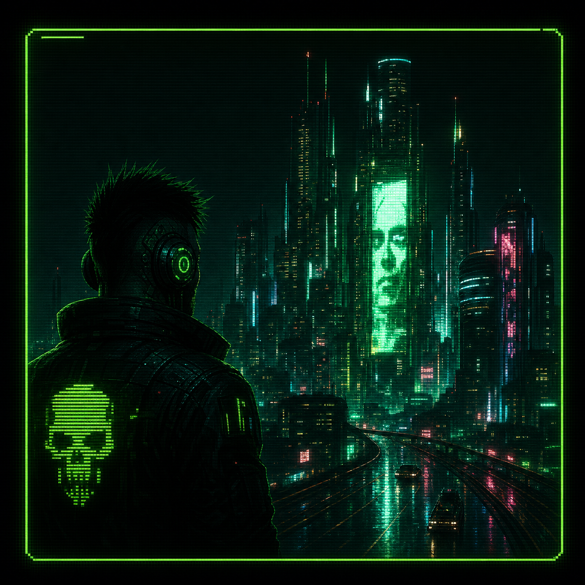

# spotify.trm v2.0.1

A **terminal-style**, Spotify-*inspired* music shell for discovery, library, a full command-line **Terminal**, and an **AI DJ** layer with real voice handoffs. Bootstrapped in **[v0](https://v0.dev)**, extended in code, and deployed on **[Vercel](https://vercel.com)**.

> **Disclaimer:** This is an independent fan / educational UI. It is **not** affiliated with, endorsed by, or connected to Spotify AB. “Spotify” here refers to the familiar product *shape* (library, queue, player) that users already understand—we re-skinned that idea for a **hacker-cyberpunk** workflow instead of cloning corporate branding.

---

## Why this direction for “Spotify”?

- **Same mental model, new skin:** People already know playlists, search, likes, and a bottom player. We keep that flow so the app is learnable in seconds.
- **Built for people who live in terminals:** Monospace UI, command logs, keyboard-first navigation, and a **DJ** tab that feels like a broadcast booth—not a marketing landing page.
- **Room for voice + LLM glue:** A consumer app shell becomes a playground for **ElevenLabs** (spoken DJ lines) and **Groq** (short scripted transitions) without pretending to be the real Spotify stack.

---

## Visuals

<p align="center">
  
</p>

**AI DJ hosts (pick a persona; each has its own ElevenLabs voice and copy tone):**

<p align="center">
  
  
  
  
</p>

**Homepage tiles (curated charts & playlists):**

<p align="center">
  
  
  
</p>

---

## Stack

| Layer | Choice |
|--------|--------|
| UI bootstrap | **v0** (`metadata.generator` is `v0.app` in `app/layout.tsx`) |
| Framework | **Next.js** 16 (App Router), **React** 19 |
| Styling | **Tailwind CSS** 4 |
| Hosting | **Vercel** (manual deploy from this repo) |
| Music data | **iTunes Search API** (previews + metadata) |
| DJ script / transitions | **Groq** (`llama-3.1-8b-instant`) via `app/api/dj` |
| DJ voice | **ElevenLabs** TTS via `app/api/tts` (keys stay server-side) |

---

## ElevenLabs (how it is used)

- **Server route:** `POST /api/tts` reads `ELEVENLABS_API_KEY` and streams audio to the client so secrets never ship to the browser.
- **Client:** `lib/textToSpeech.ts` calls `/api/tts` when `useElevenLabs` is on; browser speech is a fallback if the API fails.
- **Per-host voices:** `lib/aiDjHosts.ts` maps each AI DJ to a **distinct** preset `voiceId` plus a short **`delivery`** string for `eleven_v3`-style acting control.
- **Quick quips:** `lib/voiceResponses.ts` holds short host-specific lines for terminal actions (play, skip, arm DJ, etc.).
- **Link-mix:** When auto-DJ is live, the next iTunes preview can **start quietly under** the VO so handoffs feel like staying in the mix instead of hard silence.

---

## Groq (how it is used)

- **`POST /api/dj`** builds intro and crossfade lines from track metadata.
- Prompts include a rotating **“journey”** angle (`lib/djFlows.ts`) plus **per-host** persona and journey hints from `lib/aiDjHosts.ts` so the same queue feels different depending on which DJ is selected.

---

## Local development

```bash
# install (npm or pnpm)
npm install

# create env file (do not commit real keys)
# Windows: copy nul .env.local  then edit, or use your editor
```

**`/.env.local`**

```env
ELEVENLABS_API_KEY=your_elevenlabs_key
GROQ_API_KEY=your_groq_key
```

Optional (only if you intentionally expose keys to the client—not recommended):

```env
NEXT_PUBLIC_ELEVENLABS_API_KEY=
NEXT_PUBLIC_GROQ_API_KEY=
```

**Scripts**

```bash
npm run dev    # Next dev (webpack)
npm run build
npm run start
npm run lint
```

Open [http://localhost:3000](http://localhost:3000), pass the splash gate (**Enter**), then use the nav tabs (including **DJ** and **Terminal**).

---

## Repo map (high level)

| Path | Role |
|------|------|
| `app/page.tsx` | Shell state: playback, auto-DJ, AI host index, voice pipeline |
| `app/api/tts/route.ts` | ElevenLabs proxy |
| `app/api/dj/route.ts` | Groq DJ line generator |
| `lib/aiDjHosts.ts` | Host bios, images, `voiceId`, Groq hints |
| `lib/voiceResponses.ts` | Short spoken lines per host |
| `components/spotify/MainContent.tsx` | Home, library, AI DJ console, footer |
| `public/` | DJ host art, playlist/artist tiles, favicon |

---

## Credits & tags

- **v0** for initial UI generation and iteration.
- **ElevenLabs** for DJ text-to-speech.
- **Groq** for on-the-fly DJ script lines.

For hackathons / social posts, tag **[@v0](https://x.com/v0)** and **[@elevenlabsio](https://x.com/elevenlabsio)** where rules ask for it (e.g. `#ElevenHacks`).

---

## License

Private / educational unless you add an explicit OSS license. Do **not** commit `.env.local` or real API keys to git.
